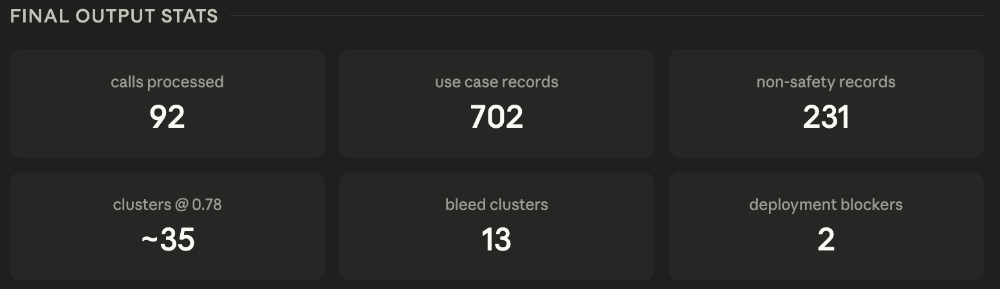

Voxel Analytics Internship — Take-Home Submission
Name: Dishita Sood
Submitted: 13 April 2026
Notion page where I planned everything: https://www.notion.so/Voxel-take-home-project-log-340464ca3e3c806b82cbd05d4a3f885c?source=copy_link

Repo Structure:
analytics-internship/

├── safety-nonsafety/   

│   └── *.json

│
├── analysis/

│   ├── use_case_analysis.py   (main script: loads, normalizes, clusters)

│   ├── requirements.txt       (Python dependencies)

│   └── clusters.csv           (output: normalized cluster summary)

│
├── memo.md 

├── SUBMISSION.md   

└── README.md                  

Design Choices by me:

Why a .py script, not a Jupyter notebook?

Notebooks are better for exploration. Scripts are easier to read linearly in a code review. Since this is a PR submission that someone will read rather than run, a flat script felt more appropriate. The script is structured sequentially (load → normalize → cluster → output) so it reads almost like a notebook anyway.

Why sentence-transformers over fuzzy matching?

fuzzywuzzy/rapidfuzz catches edit-distance near-duplicates ("track inventory" vs "inventory tracking") but misses semantic equivalents ("worker fatigue detection" vs "employee exhaustion monitoring"). Sentence transformers handle both. The model used (all-MiniLM-L6-v2) is fast (~80ms per batch) and doesn't require a GPU.

Why a CSV output, not a full data dump?

The raw JSONs are already the source of truth. The clusters.csv captures the normalized view, which labels are equivalent, how many calls each cluster appears in, and which clusters have safety/non-safety bleed. That's what's useful for a product or GTM conversation. A full CSV of every raw field would just be a louder version of the original JSONs.

Why greedy clustering, not k-means or DBSCAN?

We don't know k, and k-means centroids drift to abstract vectors that aren't readable. DBSCAN requires tuning epsilon carefully for short-phrase embeddings. Greedy single-pass with a cosine threshold keeps cluster names as actual human-readable labels from the data, which matters when you're presenting results to a non-technical audience.

Final Outputs image:

